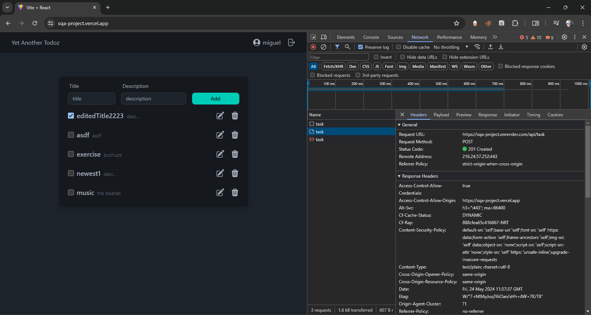
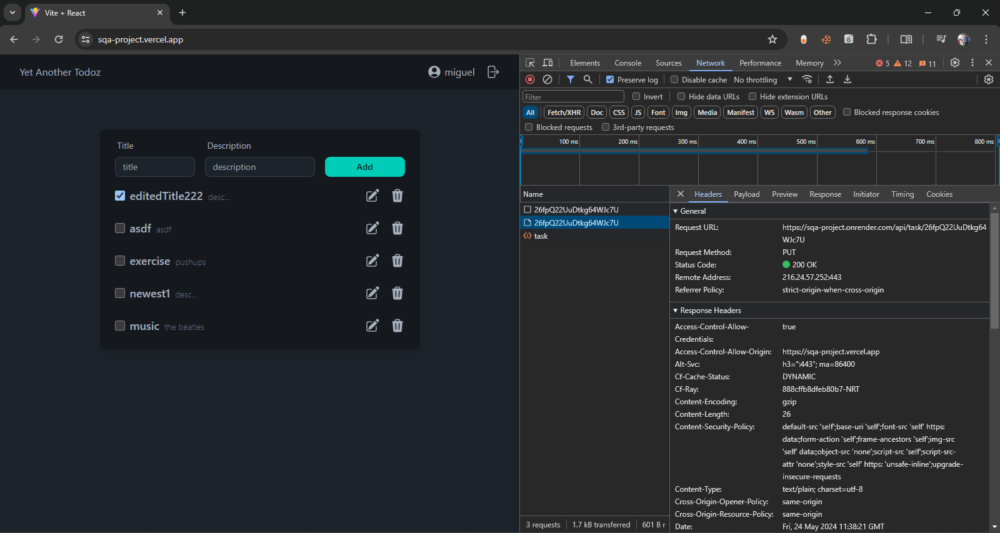
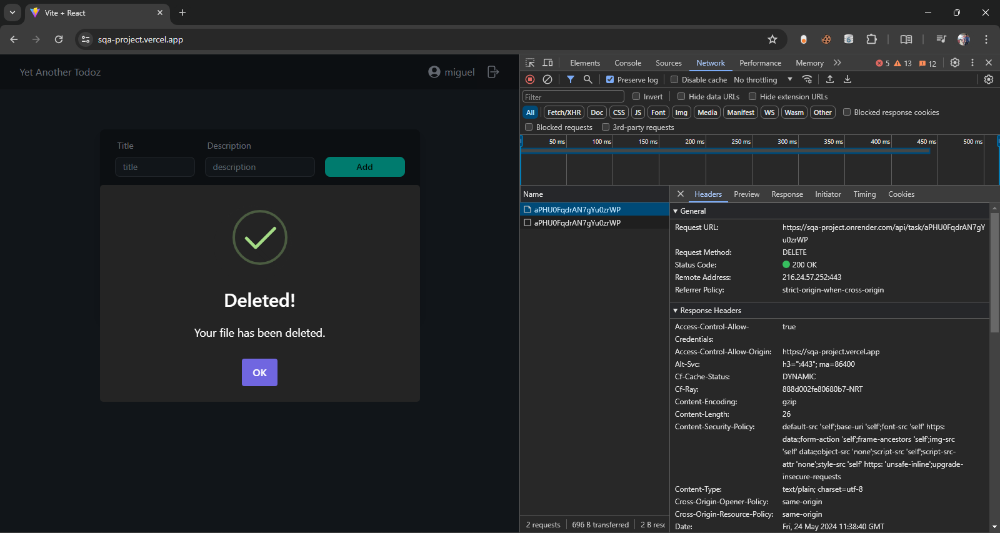

## Project Requirement for IT 3202N (Software Quality Assurance)
- Repo: https://github.com/iam-migz/sqa-project
- Deployed Web App: https://sqa-project.vercel.app/
- API: https://sqa-project.onrender.com/api
- Test Scenarios: https://docs.google.com/spreadsheets/d/14AGOBWFEtWfYUbAFyl1pt33IXQ-mpbkdMpDL5hkPtzM/edit?usp=sharing

### Tech Stack:
- Frontend
  - React 
  - DaisyUI
  - Automation Testing: Cypress E2E
- API
  - ExpressJs
  - Firebase
  - Unit Testing: Jest, Supertest

### Requests/Response in the Network Tab

Access & Refresh Tokens in a Cookie

Post Request

Put Request

Delete Request

### Members
- MIGUEL ANGEL REYES
- ANDRE CLEOFE LABENDIA
- JANUSZ NRICKE LIM OMAMALIN
- VONNE BENEDICT BERTOS GELAGA